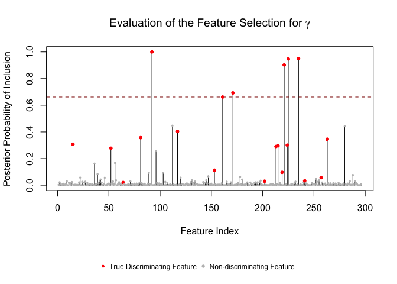
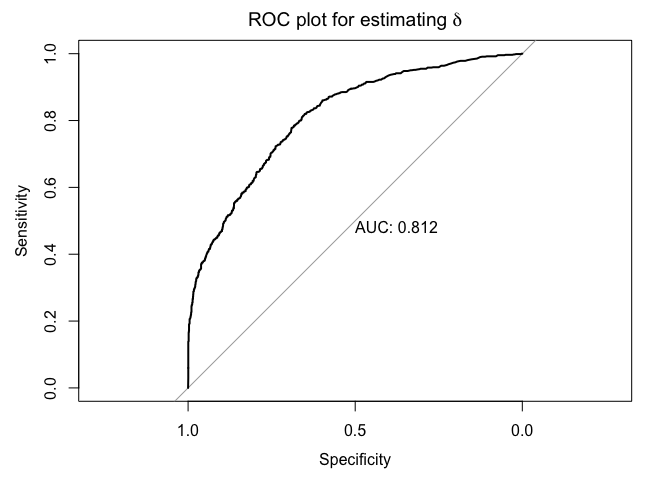

# Tutorial

The following script is used to fit micribiome count data and covariate data to the 
integrative Bayesian zero-inflated negative binomial hierarchical mixture model 
proposed in the manuscript

Before running the following code, please first load micribiome count data and covariate data.
The necessary inputs should be

1. a n-by-p count matrix Y, where n is the number of samples and p is the number 
of taxa(feature)
2. a n-by-R covaritae matrix X, where R is the number of covariates
3. a n-dimensional vector z, indicating group allocation for n samples

You also need to install `Rcpp`, `RcppArmadillo` and `pROC` packages.

##  Load functions & data matrices

```r
Rcpp::sourceCpp('ZINBwCOV.cpp');
source('functions.R');
load("Example_data.Rdata");
```

## Preprocessing

```r
# keep the features that have at least 2 observed counts for both groups:
Y.input = Y.filter(Y.mat, zvec = z.vec, min.number = 2)[[2]]
```

```
## 296 out of 300 features are kept. 
## Feature 43 81 276 289 are dropped.
```

```r
# estimate the size factor s from the count matrix Y:
s.input = sizefactor.estimator(Y.mat)
```

## Get true label for later visualization

```r
feature.remain = which(Y.filter(Y.mat, zvec = z.vec, min.number = 2)[[1]] == 1)
```

```
## 296 out of 300 features are kept. 
## Feature 43 81 276 289 are dropped.
```

```r
gamma.vec = gamma.vec[feature.remain]
delta.mat = delta.mat[,feature.remain]
```

## Implement MCMC algorithm

```r
S.iter = 10000
burn.in = 0.5
mu0.start = 10
res = zinb_w_cov(Y_mat = Y.input,
                 z_vec = z.vec, 
                 s_vec = s.input,
                 X_mat = X.mat,
                 S = S.iter, burn_rate = burn.in,
                 mu0_mean = mu0.start)
```

```
## 0% has been done
## 10% has been done
## 20% has been done
## 30% has been done
## 40% has been done
## 50% has been done
## 60% has been done
## 70% has been done
## 80% has been done
## 90% has been done
```

The MCMC outputs are stored in `res`:
    $`mu0 est`: posterior mean(after burn-in) for the vector mu(0j)
    $`phi est`: posterior mean(after burn-in) for the dispersion parameter vector
    $`beta est`: posterior mean(after burn-in) for the Beta matrix
    $`gamma PPI`: PPI for all gamma(j) after burn-in
    $`delta PPI`: PPI for all delta(rj) fter burn-in
    $`R PPI`: PPI for all r(ij) after burn-in
    $`gamma sum`: sum of all gamma(j) for all iterations
    $`mukj full`: MCMC draws for mu(kj) after burn-in
    $`mu0 full`: MCMC draws for mu(0j) after burn-in
    $`beta full`: MCMC draws for beta(rj) after burn-in

## Visualizing the results for two variable selection processes

### Variable selection for discriminating features

The stem-plot showed the selected features passing Bayesian FDR threshold.


```r
gamma_VS(res$`gamma PPI`, gamma.true = gamma.vec)
```

<!-- -->

```r
par(mar=c(5.1, 4.1, 4.1, 2.1))
```

### Variable selection for significant feature-covariate association

The ROC plot was used to benchmark the performance of detecting microbiome-covariate associations.


```r
delta_ROC(as.vector(res$`delta PPI`), as.vector(abs(delta.mat)))
```

```
## Type 'citation("pROC")' for a citation.
```

```
## 
## Attaching package: 'pROC'
```

```
## The following objects are masked from 'package:stats':
## 
##     cov, smooth, var
```

<!-- -->


# Citation

We will update this section shortly.

# Contact 

Shuang Jiang <XXX>
Last updated on December 3, 2018.

